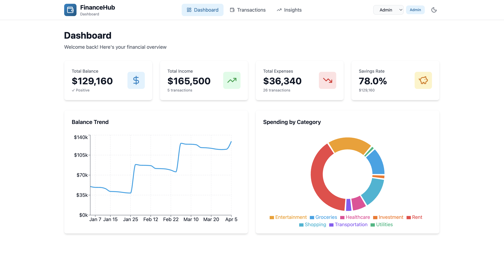
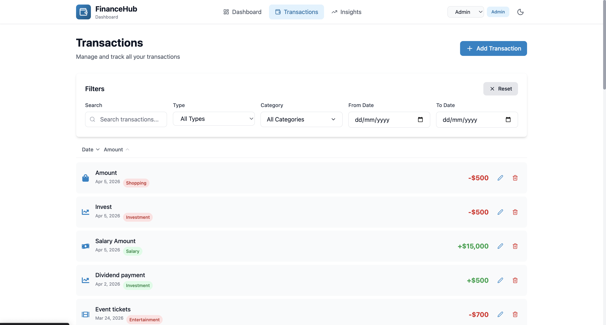
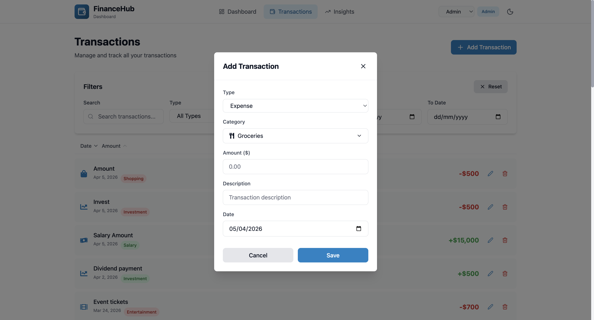
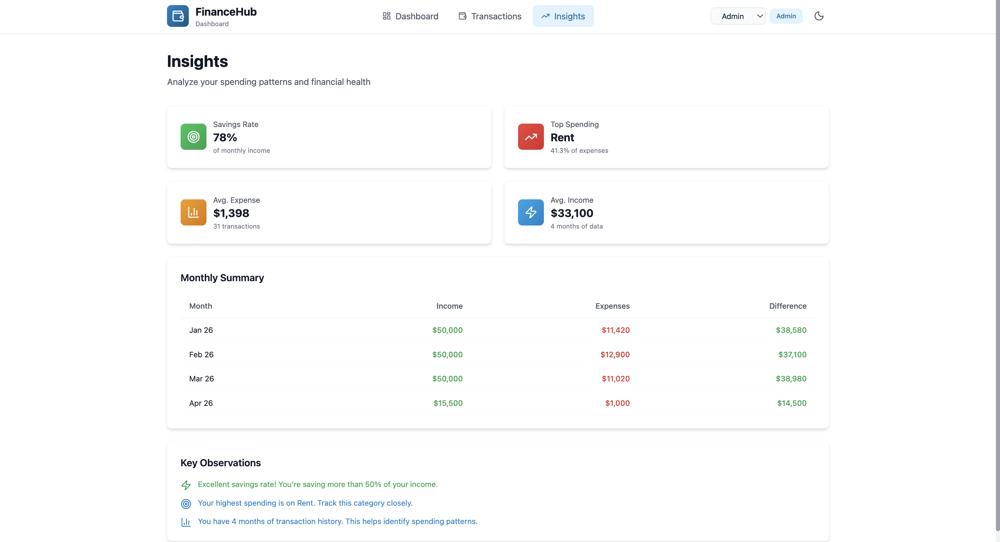
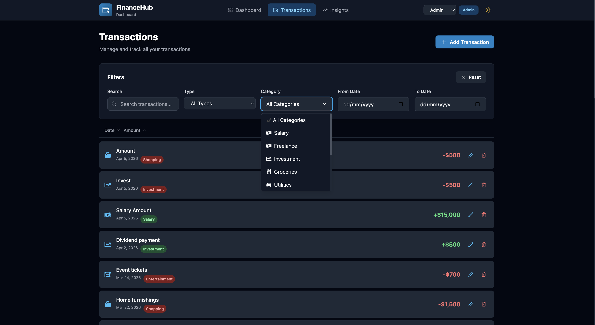

# 💰 Finance Dashboard App

A modern and responsive finance dashboard built using React.js, Zustand, Tailwind CSS, and Recharts.
This application helps users track transactions, analyze spending, and gain financial insights.

---

## 🚀 Features

### 📊 Dashboard Overview

* Total Balance, Income, Expenses summary cards
* Balance trend visualization (line chart)
* Spending breakdown by category (pie chart)

### 💳 Transactions Management

* Add, edit, and delete transactions
* View transaction details (date, amount, category, type)
* Search, filter, and sort transactions

### 🔐 Role-Based UI

* Viewer: Read-only access
* Admin: Add/Edit/Delete transactions
* Role switch using dropdown

### 📈 Insights Section

* Highest spending category
* Monthly comparison (income vs expenses)
* Savings rate and financial insights

### ⚙️ State Management

* Centralized state using Zustand
* Persistent data with localStorage

### 🎨 UI & UX

* Clean and modern UI with Tailwind CSS
* Fully responsive design
* Dark mode support 🌙
* Custom dropdowns with icons

---

## 🛠 Tech Stack

* **React.js** (Frontend Framework)
* **Zustand** (State Management)
* **Tailwind CSS** (Styling)
* **Recharts** (Data Visualization)
* **React Icons & Lucide React** (Icons)
* **Vite** (Build Tool)

---

## 📸 Screenshots

### Dashboard



### Transactions



### Add Transaction



### Insights



### Dark Mode



---

## ⚙️ Installation & Setup

Clone the repository:

```bash
git clone https://github.com/viswabrahmanavarun/finance-dashboard-app.git
cd finance-dashboard-app
```

Install dependencies:

```bash
npm install
```

Run the app:

```bash
npm run dev
```

---

## 📌 Project Highlights

* Modular and scalable architecture
* Clean separation of concerns (components, hooks, store)
* Real-world use case implementation
* Production-level UI and UX

---

